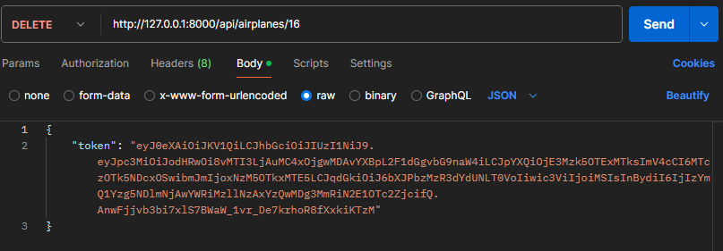

# Altavia-Airlines ✈️ (Backend)
>[!CAUTION]
>Please read all the points of the README in order to make good use of the project. Thank you.

## 💡 Description

This documentation for the backend of this project will guide you to make a correct use of the project's API.

## ❓ Installation requierements

In order to run and try this project locally you will need:

1. XAMPP (or any other local server that supports PHP and MySQL)

2. Operating System terminal

3. Install Composer

4. Install NPM via Node.js

5. Xdebug (so you can see the tests coverage)

6. Postman (or any other platform to use the API, like *Insomnia*)

## 💻 Installation

1. Clone the repository:
```
    git clone https://github.com/ArianaMartinMartinez/Altavia-Airlines.git
```

2. Move to backend folder:
```
    cd backend/Altavia-Airlines
```

3. Install project dependencies:
```
    composer install
```

4. Install NPM:
```
    npm install
```

5. Create a '.env' file by taking the example '.env.example' file and modify the lines:
    - DB_CONNECTION=mysql
    - DB_DATABASE=altavia_airlines

6. Create a database in MySQL with no tables (I use *phpMyAdmin*)


7. Generate all the tables and fake values:
```
    php artisan migrate:fresh --seed
```

8. Run NPM:
```
    npm run dev
```

9. Run Laravel (in other terminal):
```
    php artisan serve
```

This will generate an url that will lead you to the web similar to this one:
```
    http://127.0.0.1:8000/
```

## 📚 Database diagram

This is the database diagram for this project. We have four tables, **Cities**, **Airplanes**, **Users** and **Flights**.

Users and Flights have a ***ManyToMany*** relation because a flight can be booked by many users and an user can book many flights. That's where we get the **Flight_User** table.

Airplanes and Flights have a ***OneToMany*** relation because one flight is only related to one airplane but an airplane can be related to many flights.

Cities and Flights have a ***OneToMany*** relation in the *departure_id* and *arrival_id* fields because one flight can only have one departure city and one arrival city, but a city can have many departures and arrivals.


## 🔍 API Endpoints

This project has some protected routes with middlewares because only the admin user can work with them, or because the user must be logged in to do some actions. This authentication is controlled with **JSON Web Token**, so here is a guide to use all the endpoints:

### Authentication
- Register
```
    http://127.0.0.1:8000/api/auth/register
```


- Log in
```
    http://127.0.0.1:8000/api/auth/login
```


>[!NOTE]
>This endpoint will return a token which you can use to access the protected routes.

- Log out
```
    http://127.0.0.1:8000/api/auth/logout
```


- Me
```
    http://127.0.0.1:8000/api/auth/me
```


>[!NOTE]
>This endpoint will return all data from the user logged in

- Refresh
```
    http://127.0.0.1:8000/api/auth/refresh
```


>[!NOTE]
>This endpoint will return a new token for the actual user

### Users

>[!IMPORTANT]
>All these routes can only be accessed by the admin user

- GET ALL
```
    http://127.0.0.1:8000/api/users
```


- GET BY ID
```
    http://127.0.0.1:8000/api/users/{id}
```


- POST
```
    http://127.0.0.1:8000/api/users
```


- PUT
```
    http://127.0.0.1:8000/api/users/{id}
```


- DELETE
```
    http://127.0.0.1:8000/api/users/{id}
```


### Cities
>[!IMPORTANT]
>A guest or a logged in user can only see all cities and a city by ID

- GET ALL
```
    http://127.0.0.1:8000/api/cities
```


- GET BY ID
```
    http://127.0.0.1:8000/api/cities/{id}
```


- POST
```
    http://127.0.0.1:8000/api/cities
```


- PUT
```
    http://127.0.0.1:8000/api/cities/{id}
```


- DELETE
```
    http://127.0.0.1:8000/api/cities/{id}
```


### Airplanes
>[!IMPORTANT]
>All these routes can only be accessed by the admin user

- GET ALL
```
    http://127.0.0.1:8000/api/airplanes
```


- GET BY ID
```
    http://127.0.0.1:8000/api/airplanes/{id}
```


- POST
```
    http://127.0.0.1:8000/api/airplanes
```


- PUT
```
    http://127.0.0.1:8000/api/airplanes/{id}
```


- DELETE
```
    http://127.0.0.1:8000/api/airplanes/{id}
```


### Flights
>[!IMPORTANT]
>A guest or a logged in user can only see all flights

- GET ALL
```
    http://127.0.0.1:8000/api/flights
```


- GET BY ID
```
    http://127.0.0.1:8000/api/flights/{id}
```


- POST
```
    http://127.0.0.1:8000/api/flights
```


- PUT
```
    http://127.0.0.1:8000/api/flights/{id}
```


- DELETE
```
    http://127.0.0.1:8000/api/flights/{id}
```


### Bookings
>[!IMPORTANT]
>Only a logged in user can book or cancel a flight

- BOOK A FLIGHT
```
    http://127.0.0.1:8000/api/book/{id}
```


- CANCEL A FLIGHT
```
    http://127.0.0.1:8000/api/cancel/{id}
```


## 👾 Tests

This project has a **86.7%** of test coverage.

You can try the tests and see the coverage in the terminal using:
```
   php artisan test --coverage
```


>[!TIP]
>You can also see the coverage in a web browser using:
>```
>   php artisan test --coverage-html=coverage-report
>```