# Altavia-Airlines ✈️ (Frontend)
>[!CAUTION]
>Please read all the points of the README in order to make good use of the project. Thank you.

## 💡 Description

This documentation for the frontend of this project will guide you to make a correct use of the project's website.

## 💼 Project guide

In this project the first view we see is the home page, where we can see a *"Book now"* button that will take us to the flights page; as well as the header and footer.

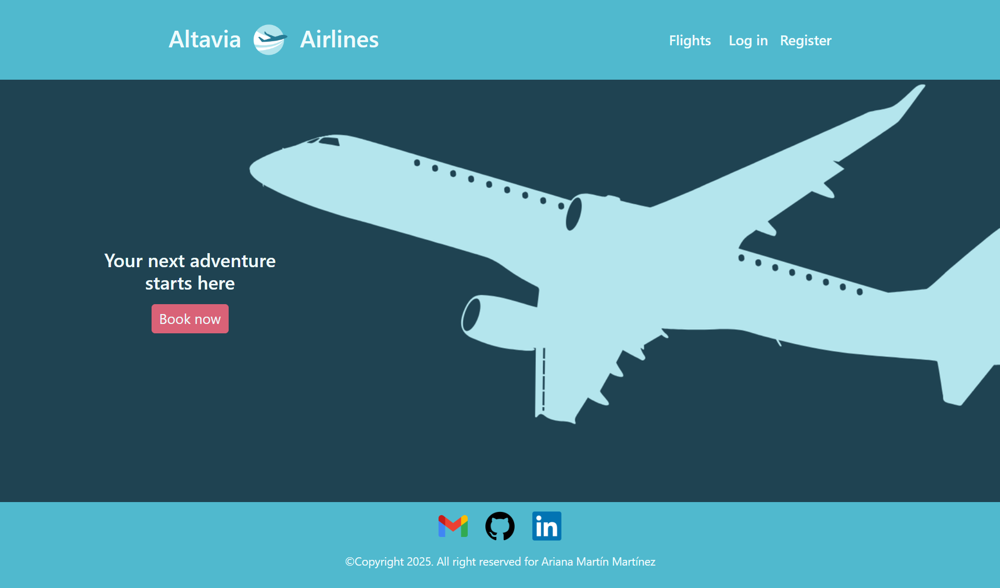

We can see all the flights if we are not logged in.

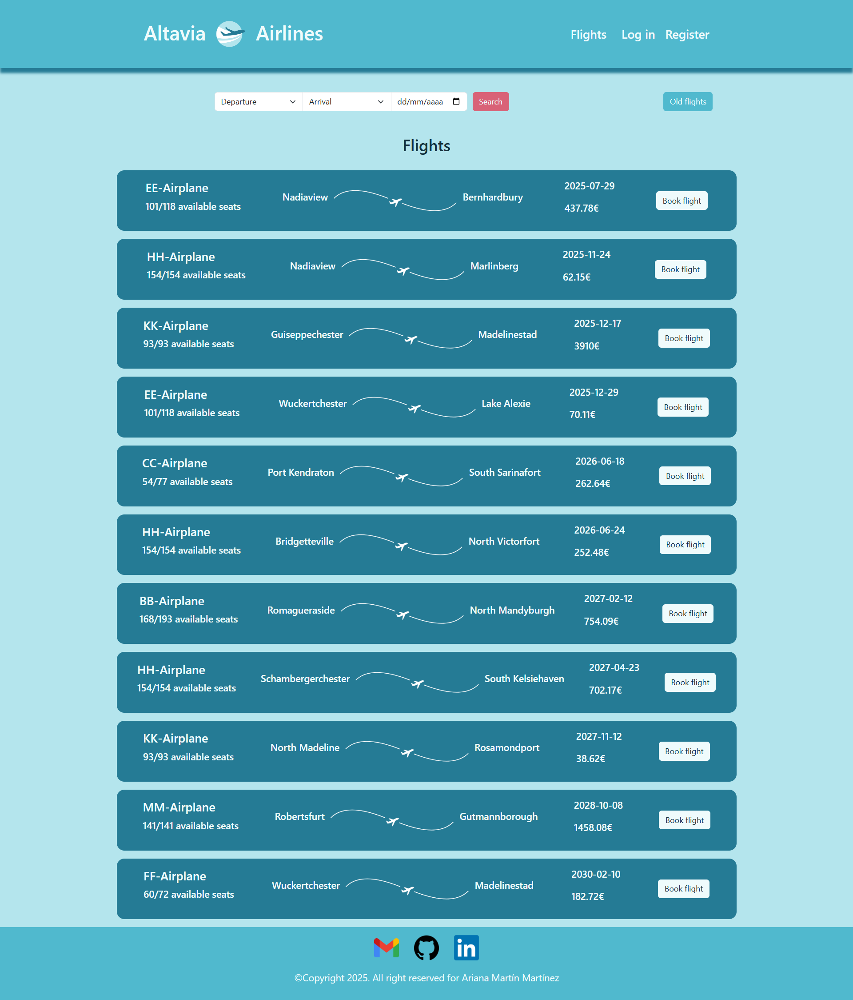
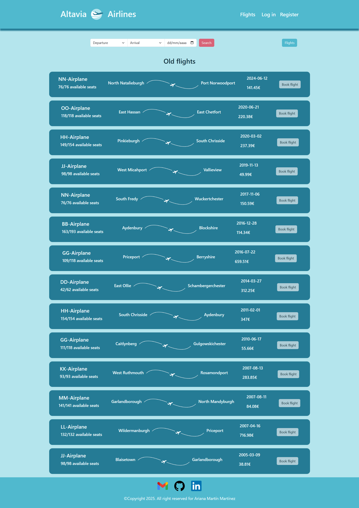

But we have to log in to book a flight, so if we try to book a flight it will appear a message:

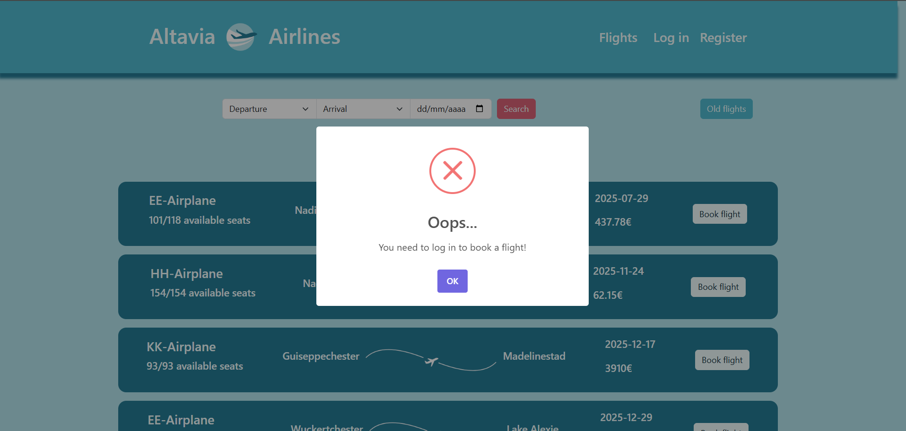

If we click on "Register" on the header it will take us to the register form where we can enter our information and have access to the website's functionalities.

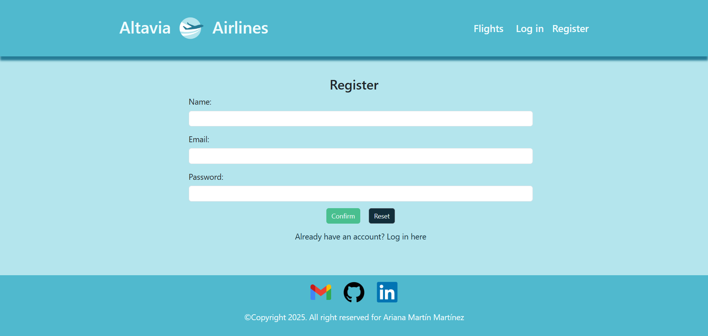

Once we are registered, we can log in.

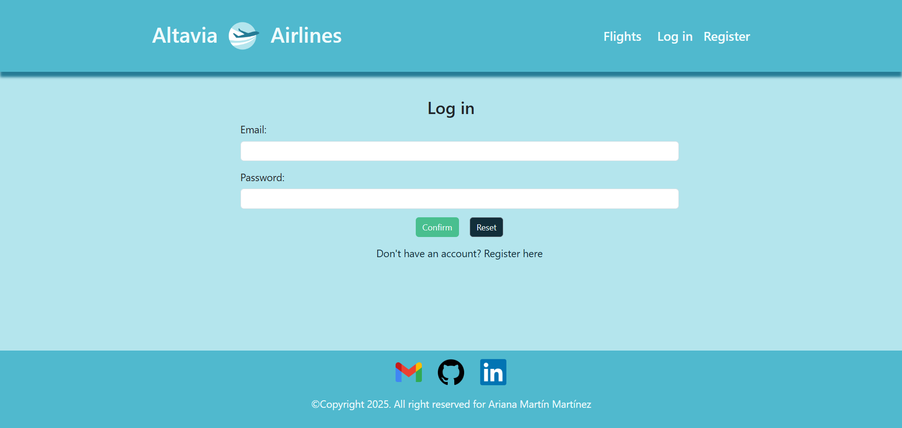

### Role user functionalities

Now that we're logged in we can book and cancel flights:

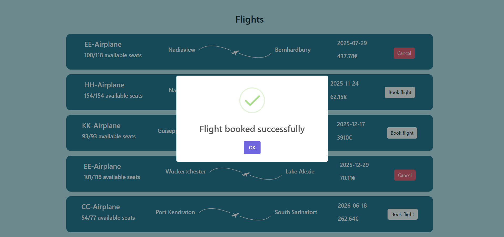
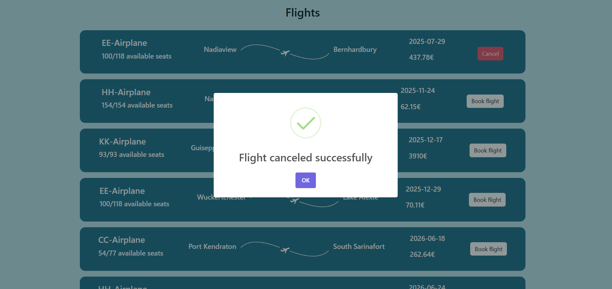

We also have a page where we can see our bookings; ordered by most recent, future and old bookings:

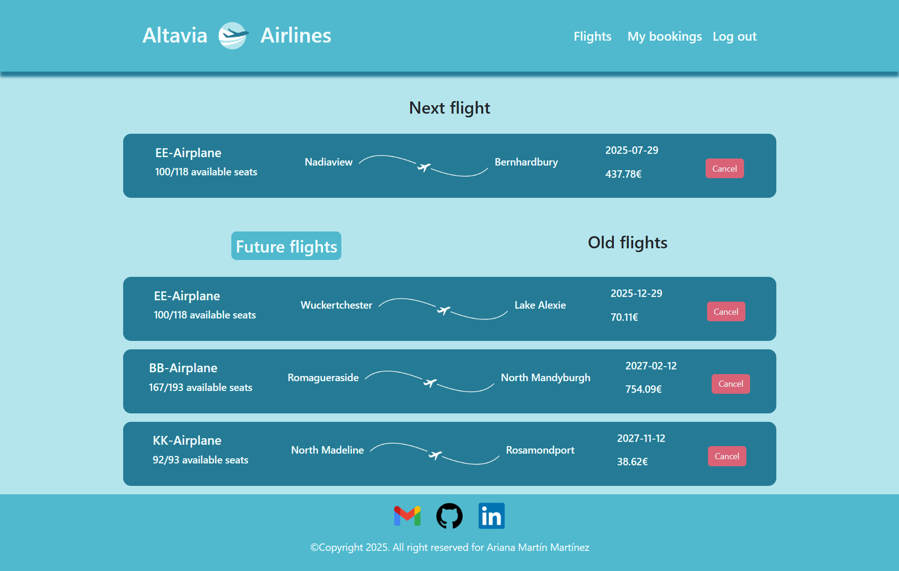
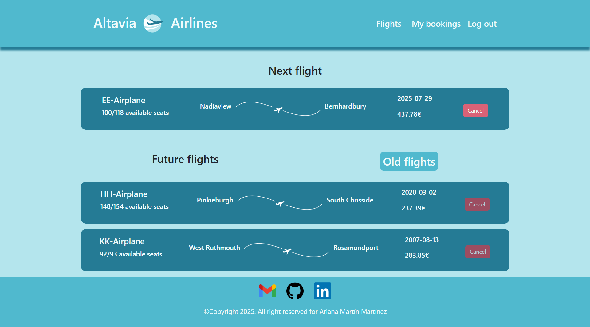

### Role admin functionalities

In the other hand, if the user logged in has the role *admin* the view will be a little different. Admin can have a detailed view of every flight and the user's that booked that flight.

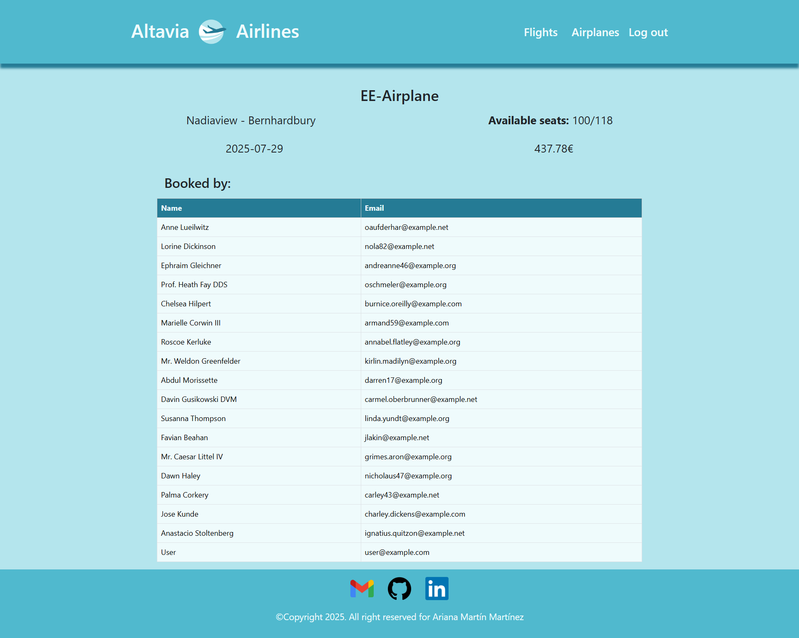

Admin can also create a new flight with all the necessary data and edit an specific one:

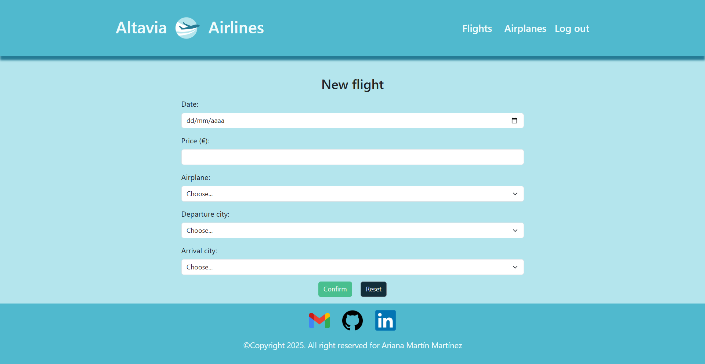


Admin also has a page where a list of all the airplanes availables are displayed.

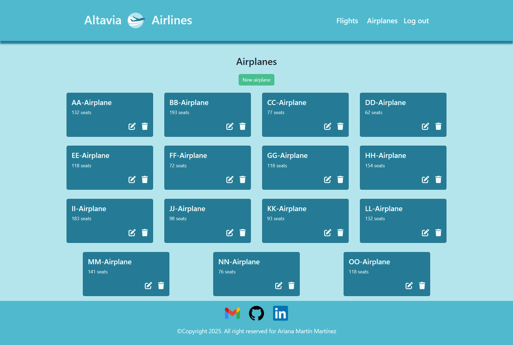

And in this page admin can create a new airplane with all the necessary data and edit an specific one:


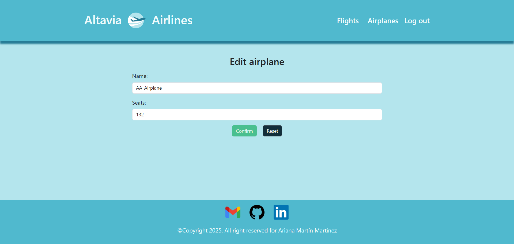

## ❓ Installation requierements

In order to run and try this project locally you will need:

1. Install Angular CLI

2. Operating System terminal

3. Install NPM via Node.js

4. Moder web browser

## 💻 Installation

1. Clone the repository:
```
    git clone https://github.com/ArianaMartinMartinez/Altavia-Airlines.git
```

2. Move to frontend folder:
```
    cd frontend/Altavia-Airlines
```

3. Install project dependencies:
```
    npm install
```

9. Run Angular (in other terminal):
```
    ng serve
```

This will generate an url that will lead you to the web similar to this one:
```
    http://localhost:4200/
```

## 🎨 Figma design

For this project I designed a Figma project in order to develop my website in a clearer and more orderly way. Here a preview:

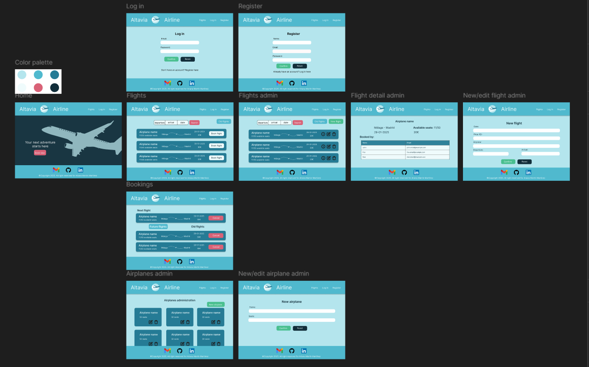

## 🔗 API integration

### 🌍 Backend's URL configuration

The backend's URL is store in the ***environment*** folder and exported as a JSON constant. This allows easy switching between development and production environments.

```
    export const environment = {
    apiUrl: 'http://127.0.0.1:8000/api'
    }
```

Like this it can be easily used in the services like this:

```
    private apiUrl = environment.apiUrl;
```

### 🔐 Authentication with JSON Web Token (JWT)

The authentication system is handled with JWT, and its management is centralized in the **TokenService** and **AuthService**.

- **tokenService:** this service is responsible for storing, retrieving, and deleting the JWT token in localStorage.
- **AuthService:** this service handles login, registration, and logout requests.

### 🛡️ Route protection with guard

To restrict access to certain routes only to authenticated users, an **AuthGuard** is used to check for token existence.